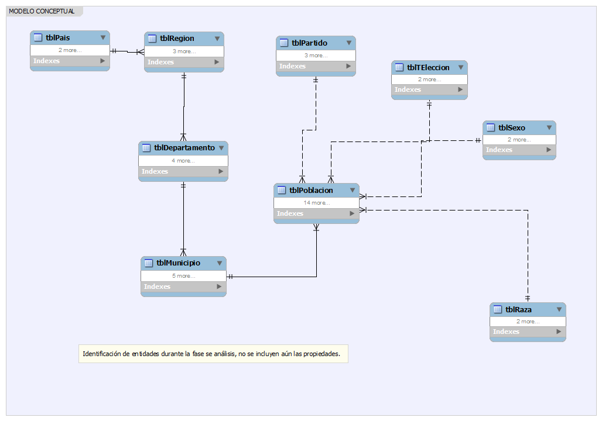

###### BASES DE DATOS 1
# DOCUMENTACION TECNICA PROYECTO
### INSTITUTO CENTROAMERICANO ELECTORAL - ICE
* **Descripción Problema**
    
    ICE es una institución dedicada a registrar, controlar y evaluar estadisticas de procesos electorales a nivel internacional, sin embargo actualmente presenta incosistencia; así como otra serie de dificultades para dichos controles sobre los datos que se manejan.  Dicha problematica se debe a que el manejo de la información se lleva por medio de hojas electrónicas; por tal razón se debe replantear tanto un nuevo modelo de control tomando en consideración que debe implementarse una migración de datos.

    Las indicaciones y requerimientos destallados se pueden consultar en [Proybd1.pdf](Proybd1.pdf)

* **Fase de Análisis - Evaluación de Requerimientos**
    
    Luego de una amplia evaluación sobre los requerimientos que se ha hecho llegar de forma escrita ilustrando la problemática, así como describiendo de forma detallada (por medio de un file excel con datos de muestra) se ha hecho las evaluaciones correspondientes e identificado las necesidades generales y puntuales para dar solución.  Se mencionan a continuación algunas de dichas evaluaciones:

    * *Desarrollo de Modelo Conceptual*

        Importante el desarrollo de un modelo lógico para identificar las entidades involucrados a nivel de datos, partiendo del file proporcionado.  Acá se debe tomar en cuenta ya algunas posibles formas de normalizaciónd de los datos que permitan eliminar la redundanacia de datos.

         

    * *Desarrollo de Modelo Lógico*

        En éste modelo ya se van identicando propiedades sobre las entidades y también posibles relaciones que permitan eliminar redundancia de datos.

        
        
     * *Desarrollo de Modelo Fisico*

        Acá establecemos ya en definitiva la estructura del nuevo modelo de almacenamiento de los datos, acá se han evaluado y aplicado ya las reglas de normalización necesarias para garantizar la correcta gestión de los datos; ésto según el file plano que se ha proporcionado.   

               

* **NORMALIZACIÓN - Evaluación File Datos**
    
    Mencionamos los pasos en la evaluación de file que se proporcionó para aplicación de reglas de normalización sobre los modelos antes desarrollados:

    * Generación tabla tblTElección: 
        
            Gestión de los diferentes tipos de elección.

    * Generación tabla tblPais:

            Gestión de los diferentes países donde se efectúan procesos electorales.

    * Generación tabla tblRegion:

            Gestión de las regiones de cada país.

    * Generación tabla tblDepartamento:

            Gestión de los departamentos por región.

    * Generación tabla tblMunicipio:

            Gestión de los municipios por departamento.

    * Generación tabla tblPartido:

            Gestión de las diferentes agrupaciones políticas que participan en procesos electorales.

    * Generación tabla tblSexo:

            Gestión de sexo (Hombres, Mujeres) del padrón de votantes.

    * Generación talbla tblRaza:

            Gestión de clasificación de la raza (Indigena, Garífuna, Ladino) de los votantes.

    * Generación tabla tblPoblación:

            Representa la tabla principal sobre la cual se almacenan los datos de las diferentes clasificaciones de votantes.

* **Script Generación Base de Datos**
    * *Creación Base de Datos*
        
        Se muestra el Script MYSQL - DBMS sobre el cual se ha desarrollado la implementación del modelo relacional de datos para el manejo correcto de la información:

        [Script Creación Base de Datos](ScriptCreacion.sql)

* **Script Carga de Datos**
    * *Carga de Datos a partir del file proporcionado*
        
        Se detalla el script implementado para la carga masiva de datos a partir del file proporcionado (file formato excel convertido a formato CSV):

       [Script Carga de Datos](CargaDatos.sql)

* **Script Carga de Datos**
    * *Consultas implementadas como prueba del nuevo modelo*
        
        Se han desarrollado una serie de consultas a la nueva base datos; ésto con el fin de verificar la funcionalidad de la nueva estructura:

         [Script Consultas SQL](Consultas.sql)

* **Anexo - File Formato CSV**

    * *File Formato CSV*

        Se muestra a continuación el file de carga de datos en formato txt, para su utilización.

       [FILE - CSV - TXT](fuente00.csv)

        

